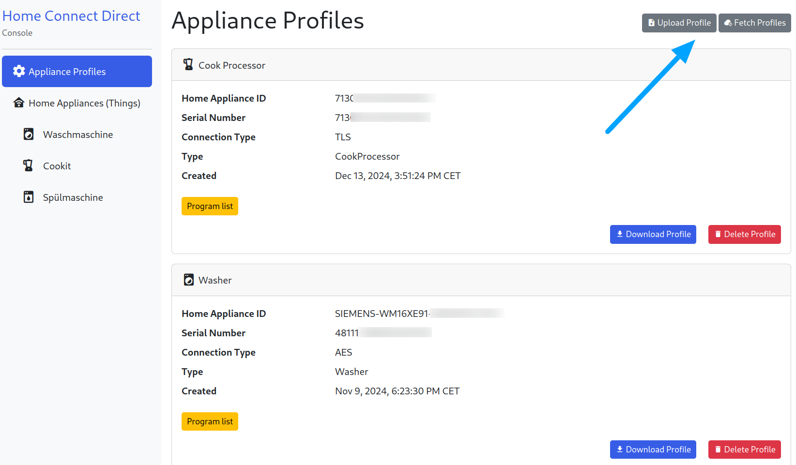

# Home Connect Direct Binding

The Home Connect Direct Binding integrates [Home Connect](https://www.home-connect.com/) enabled devices into openHAB.
It allows seamless communication with your appliances over your local network.
This ensures reliable and secure operation without requiring any cloud access.
To get started, the configuration of your appliances needs to be loaded once during the initial setup.

This binding is built upon the outstanding work of the following projects:
- [osresearch/hcpy](https://github.com/osresearch/hcpy)
- [hcpy2-0/hcpy](https://github.com/hcpy2-0/hcpy)

A big thank you to the contributors of these projects for their excellent work!

## Supported Things


| Home appliance                             | Thing Type ID |
|--------------------------------------------| ------------ |
| Dishwasher                                 | dishwasher |
| Cook Processor (Cookit)                    | cookprocessor |
| Washer                                     | washer |
| Washer / Dryer combination                 | washerdryer |
| Dryer                                      | dryer |
| Oven                                       | oven |
| Coffee Machine                             | coffeemaker |
| Generic (other appliance types) | generic |

## Discovery

Things are discovered via UPnP on the local network. Alternatively, you can add devices manually by IP address.

## Binding Configuration

The binding provides two configuration groups: **SingleKey ID** and **HTTP Basic Authentication**.

### SingleKey ID

The SingleKey ID settings include the login credentials for Home Connect.
These are the same credentials used in the official Home Connect app.
The credentials need to be entered only once.
After fetching the appliance configuration from the cloud using these credentials, this step does not need to be repeated.
The configuration can also be exported and imported for easier management.

### HTTP Basic Authentication

The HTTP Basic Authentication settings are used to protect the separate binding web console.
If you wish to secure this page, you can define a username and password here.
Basic authentication is deactivated by default.

### Configuration Methods

Both configuration groups can be managed either via the **openHAB UI** or the **OSGi Console**.

#### Configuration via openHAB UI
1. Navigate to:  
   **Administration** -> **Settings** -> **Add-on Settings** -> **Home Connect Direct**

#### Configuration via OSGi Console
1. Open the console (e.g., `ssh -p 8101 openhab@localhost`)
2. Run the following commands:
   ```shell
   openhab> config:edit binding.homeconnectdirect
   openhab> config:property-set singleKeyIdUsername [SingleKey ID email]
   openhab> config:property-set singleKeyIdPassword [SingleKey ID password]
   openhab> config:property-set basicAuthEnabled [true or false]
   openhab> config:property-set basicAuthUsername [Home Connect Direct Console username]
   openhab> config:property-set basicAuthPassword [Home Connect Direct Console password]
   openhab> config:property-list
   openhab> config:update

## Thing Configuration

### Load Appliance Profiles

This binding provides a dedicated web user interface to manage and interact with your Home Connect-enabled appliances.
It allows you to configure appliance profiles, which contain the keys and descriptions required for communication with your home devices.

1. **Open the Home Connect Direct Console**  
   The binding includes a separate user interface accessible through your web browser at: `http(s)://[YOUROPENHAB]:[YOURPORT]/homeconnectdirect`  
   For example: `http://192.168.178.100:8080/homeconnectdirect`
2. **Navigate to Appliance Profiles**  
   Once on the console page, open the **"Appliance Profiles"** menu.
3. **Managing Profiles**
   In the top-right corner of the "Appliance Profiles" page, you will find two buttons:

   - **Upload Profile**:  
   Use this option to import appliance profiles that have been previously downloaded or saved.
   This helps you restore configurations without fetching them again.

   - **Fetch Profiles**:  
   Selecting this option retrieves and updates the profiles of all devices currently connected to your Home Connect account. This process may take a few seconds, depending on the number of devices.

   

By following these steps, you can easily add or update your appliance profiles, ensuring smooth communication and interaction with your Home Connect-enabled devices.

> **INFO:** You can also download and securely store these profiles at any time, ensuring you always have a backup of your appliance configurations.

### Create Things

You can discover and add Home Connect devices in multiple ways:

- **Automatic Discovery via UPnP**:  
  Use the UPnP feature to scan your network and automatically find supported Home Connect devices.

- **Manual Configuration**:  
  If automatic discovery is not suitable for your environment, you can manually add devices either through a `things` file or by using the openHAB UI.

#### Thing configuration parameters

| Name            | Type    | Description                                                                                                       | Default         | Required | Advanced |
|-----------------|---------|-------------------------------------------------------------------------------------------------------------------|-----------------|----------|----------|
| haId        | text    | Unique identifier representing a specific home appliance. The `haId` (Home Appliance ID) can be found in the Home Connect Direct console. It is displayed on the "Appliance Profile" page.                                                        | N/A             | yes      | no       |
| address        | text    | Address of home appliance (hostname or IP)                                                                        | N/A             | yes      | no       |
| connectionType        | text    | Type of encryption, whether to use AES with websocket (`AES_HMAC_SHA256`) or use TLS encrypted websocket (`TLS`). | AES_HMAC_SHA256 | yes      | no       |
| connectionRetryDelay | integer | Reconnect delay in minutes (min: 1 max: 60)                                                                       | 1               | no       | yes      |

> **INFO:** Due to the libraries used by this binding, the connection type `TLS` is currently unavailable on some systems, such as ARM-based Linux.  
Please keep this limitation in mind when setting up things on such platforms.


## Channels

The binding comes with a wide range of preconfigured channels, making it easy to control and monitor your Home Connect devices.  
However, due to the large number of options, settings, and features available, not all possible configurations can be supported by default.

To address this, the binding also provides the ability to add **Dynamic Channels**.  
This allows you to customize the setup to suit your specific needs and extend the functionality of your Home Connect integration.

## Preconfigured Channels

| Channel ID                                     | Item Type            | Read only | Description                                                                                                                                                                                                                                                                                                        | Available on thing                                                       |
|------------------------------------------------|----------------------|-----------|--------------------------------------------------------------------------------------------------------------------------------------------------------------------------------------------------------------------------------------------------------------------------------------------------------------------|--------------------------------------------------------------------------|
| power_state                                    | Switch               | false     | This setting describes the current power state of the home appliance.                                                                                                                                                                                                                                              | dishwasher, oven, coffeemaker, cookprocessor                             |
| door_state                                     | Contact              | true      | This status describes the door state of a home appliance. A status change is either triggered by the user operating the home appliance locally (i.e. opening/closing door) or automatically by the home appliance (i.e. locking the door).                                                                         | dishwasher, washer, washerdryer, dryer, oven                             |
| operation_state                                | String               | true      | This status describes the operation state of the home appliance.                                                                                                                                                                                                                                                   | dishwasher, washer, washerdryer, dryer, oven, coffeemaker, cookprocessor |
| remote_start_allowance                         | Switch               | true      | This status indicates whether the remote program start is enabled. This can happen due to a programmatic change (only disabling), or manually by the user changing the flag locally on the home appliance, or automatically after a certain duration - usually in 24 hours.                                        | dishwasher, washer, washerdryer, dryer, oven, coffeemaker                |
| remote_control_active                          | Switch               | true      | This status indicates whether the allowance for remote controlling is enabled.                                                                                                                                                                                                                                     | dishwasher, washer, washerdryer, dryer, oven                             |
| local_control_active                           | Switch               | true      | This status indicates local activity by user.                                                                                                                                                                                                                                                                      | washer, washerdryer, dryer, oven, coffeemaker                            |
| active_program                                 | String               | true      | This status describes the active program of the home appliance.                                                                                                                                                                                                                                                    | dishwasher, washer, washerdryer, dryer, oven, coffeemaker, cookprocessor |
| selected_program                               | String               | false     | This state describes the selected program of the home appliance.                                                                                                                                                                                                                                                   | dishwasher, washer, washerdryer, dryer, oven, coffeemaker                |
| remaining_program_time                         | Number:Time          | true      | This status indicates the remaining program time of the home appliance.                                                                                                                                                                                                                                            | dishwasher, washer, washerdryer, dryer, oven                             |
| oven_duration                                  | Number:Time          | true      | This status describes the duration of the program of the home appliance.                                                                                                                                                                                                                                           | oven                                                                     |
| washer_temperature                             | String               | false     | This status describes the temperature of the washing program of the home appliance.                                                                                                                                                                                                                                | washer, washerdryer                                                      |
| washer_spin_speed                              | String               | false     | This status defines the spin speed of a washer program of the home appliance.                                                                                                                                                                                                                                      | washer, washerdryer                                                      |
| idos1_fill_level_poor                          | Switch               | true      | Indicates whether the i-Dos 1 is almost empty (if appliance supports i-Dos).                                                                                                                                                                                                                                       | washer, washerdryer                                                      |
| idos2_fill_level_poor                          | Switch               | true      | Indicates whether the i-Dos 2 is almost empty (if appliance supports i-Dos).                                                                                                                                                                                                                                       | washer, washerdryer                                                      |
| idos1_active                                   | Switch               | false     | This status indicates whether i-Dos 1 is activated for a washer program of the home appliance. (If appliance supports i-Dos)                                                                                                                                                                                       | washer, washerdryer                                                      |
| idos2_active                                   | Switch               | false     | This status indicates whether i-Dos 2 is activated for a washer program of the home appliance. (If appliance supports i-Dos)                                                                                                                                                                                       | washer, washerdryer                                                      |
| laundry_load_information                       | Number:Mass          | true      | This status describes the current laundry load information of the home appliance.                                                                                                                                                                                                                                  | washer, washerdryer, dryer                                               |
| laundry_load_recommendation                    | Number:Mass          | true      | This channel indicates the maximum laundry load recommended for a program of the home appliance.                                                                                                                                                                                                                   | washer, washerdryer, dryer                                               |
| laundry_process_phase                          | String               | true      | This status describes the process phase of the home appliance.                                                                                                                                                                                                                                                     | washer, dryer, washerdryer                                               |
| drum_clean_reminder                            | Switch               | true      | Indicates whether the washer drum needs cleaning.                                                                                                                                                                                                                                                                  | washer, washerdryer                                                      |
| drying_target                                  | String               | false     | This status defines the desired dryness of a program of the home appliance.                                                                                                                                                                                                                                        | dryer, washerdryer                                                       |
| countdown_cleaning                             | Number               | true      | Shows a countdown indicating the time remaining until cleaning task is due.                                                                                                                                                                                                                                        | coffeemaker                                                              |
| countdown_calc_and_clean                       | Number               | true      | Shows a countdown indicating the time remaining until cleaning and descaling task is due.                                                                                                                                                                                                                          | coffeemaker                                                              |
| countdown_descaling                            | Number               | true      | Shows a countdown indicating the time remaining until descaling task is due.                                                                                                                                                                                                                                       | coffeemaker                                                              |
| countdown_water_filter                         | Number               | true      | Shows a countdown indicating the time remaining until replace water filter task is due.                                                                                                                                                                                                                            | coffeemaker                                                              |
| water_tank_empty                               | Switch               | true      | Indicates when the coffee machine's water tank is empty.                                                                                                                                                                                                                                                           | coffeemaker                                                              |
| water_tank_nearly_empty                        | Switch               | true      | Indicates when the coffee machine's water tank is almost empty.                                                                                                                                                                                                                                                    | coffeemaker                                                              |
| drip_tray_full                                 | Switch               | true      | Indicates when the drip tray of the coffee machine is full.                                                                                                                                                                                                                                                        | coffeemaker                                                              |
| empty_milk_tank                                | Switch               | true      | Indicates when the coffee machine's milk tank is empty.                                                                                                                                                                                                                                                            | coffeemaker                                                              |
| bean_container_empty                           | Switch               | true      | Indicates that the coffee machine's bean container is empty.                                                                                                                                                                                                                                                       | coffeemaker                                                              |
| salt_lack                                      | Switch               | true      | Indicates if the dishwasher salt is empty.                                                                                                                                                                                                                                                                         | dishwasher                                                              |
| rinse_aid_lack                                 | Switch               | true      | Indicates if the dishwasher rinse aid is empty.                                                                                                                                                                                                                                                                    | dishwasher                                                              |
| salt_nearly_empty                              | Switch               | true      | Indicates when the dishwasher salt is almost empty.                                                                                                                                                                                                                                                                | dishwasher                                                              |
| rinse_aid_nearly_empty                         | Switch               | true      | Indicates when the dishwasher rinse aid is almost empty.                                                                                                                                                                                                                                                           | dishwasher                                                              |
| machine_care_reminder                          | Switch               | true      | Indicates whether the dishwasher needs cleaning.                                                                                                                                                                                                                                                                   | dishwasher                                                               |
| program_progress                               | Number:Dimensionless | true      | This status describes the program progress of the home appliance in percent.                                                                                                                                                                                                                                       | dishwasher, washer, washerdryer, dryer, oven, coffeemaker, cookprocessor |
| program_command                                | String               | false     | Adds basic controller actions to the appliance. The following basic commands are supported: `start` (start current selected program), `stop` (stop current program), `pause` (pause program information) and `resume`. Furthermore it is possible to send raw (Home Connect JSON payload) to the home appliance.   | dishwasher, oven, washer, washerdryer, dryer, coffeemaker, cookprocessor |
| program_phase                                  | String               | true      | This status describes the program phase of the home appliance.                                                                                                                                                                                                                                                     | dishwasher                                                               |
| process_phase                                  | String               | true      | This status describes the process phase of the home appliance.                                                                                                                                                                                                                                                     | coffeemaker                                                              |

## Dynamic Channels

| Channel Type Id | Type   | Read/Write | Description                                                            |
|-----------------|--------|------------|------------------------------------------------------------------------|
| switch          | Switch | RW         | This channel type can be used to represent boolean values as switches. |
| string          | String | RW         | This channel type can be used to represent strings.                    |
| number          | Number | RW         | This channel type can be used to represent number values.              |

## Full Example

Below is an example of how to configure and use a Home Connect device with the openHAB Home Connect Direct Binding using textual configuration files (`*.things` and `*.items`).

### Thing Configuration

```java
Thing homeconnectdirect:dishwasher:siemens-sn658x06te   "Dishwasher"      [ haId = "SIEMENS-SN658X06TE-000000000000", address = "10.168.2.241", connectionType = "AES_HMAC_SHA256", connectionRetryDelay = 1 ] {
    Channels:
        Type switch     : brandLogo                     "Brand Logo"      [ eventKey = "Dishcare.Dishwasher.Setting.BrandLogo" ]
        Type string     : timeFormat                    "Time Format"     [ eventKey = "Dishcare.Dishwasher.Setting.TimeFormat" ]
}

Thing homeconnectdirect:washer:siemens-wm16xe91         "Washer"          [ haId = "SIEMENS-WM16XE91-000000000000", address = "10.168.2.240", connectionType = "AES_HMAC_SHA256", connectionRetryDelay = 2 ] {
    Channels:
        Type string     : iDosTray                      "i-Dos Open Tray" [ eventKey = "LaundryCare.Washer.Event.IDos.IDosOpenTray" ]
}

Thing homeconnectdirect:cookprocessor:bosch-mcc9555dwc  "Cookit"          [ haId = "000000000000000000", address = "10.168.2.242", connectionType = "TLS", connectionRetryDelay = 1 ] {
    Channels:
        Type number     : buttonVolume                  "Button Volume"   [ eventKey = "BSH.Common.Setting.Sound.Button.Volume" ]
}
```
### Item Configuration

```java
Contact                    Dishwasher_DoorState                     "Door [MAP(contact.map):%s]"                         <contact>            { channel = "homeconnectdirect:dishwasher:siemens-sn658x06te:door_state" }
String                     Dishwasher_OperationState                "Operation State"                                    <dishwasher>         { channel = "homeconnectdirect:dishwasher:siemens-sn658x06te:operation_state" }
Number:Time                Dishwasher_RemainingProgramTimeState     "Remaining Program Time"                             <time>               { channel = "homeconnectdirect:dishwasher:siemens-sn658x06te:remaining_program_time" }
Number:Dimensionless       Dishwasher_ProgramProgressState          "Program Progress State [%d %%]"                     <time>               { channel = "homeconnectdirect:dishwasher:siemens-sn658x06te:program_progress", unit="%" }
Switch                     Dishwasher_SaltLack                      "Salt Lack[]"                                        <cistern>            { channel = "homeconnectdirect:dishwasher:siemens-sn658x06te:salt_lack" }
Switch                     Dishwasher_RinseAidLack                  "Rinse Aid Lack[]"                                   <cistern>            { channel = "homeconnectdirect:dishwasher:siemens-sn658x06te:rinse_aid_lack" }
Switch                     Dishwasher_SaltNearlyEmpty               "Salt Nearly Empty[]"                                <cistern>            { channel = "homeconnectdirect:dishwasher:siemens-sn658x06te:salt_nearly_empty" }
Switch                     Dishwasher_RinseAidNearlyEmpty           "Rinse Aid Nearly Empty[]"                           <cistern>            { channel = "homeconnectdirect:dishwasher:siemens-sn658x06te:rinse_aid_nearly_empty" }
Switch                     Dishwasher_MachineCareReminder           "Machine Care Reminder[]"                            <rain>               { channel = "homeconnectdirect:dishwasher:siemens-sn658x06te:machine_care_reminder" }
Switch                     Dishwasher_BrandLogo                     "Brand Logo[]"                                                            { channel = "homeconnectdirect:dishwasher:siemens-sn658x06te:brandLogo" }
String                     Dishwasher_TimeFormat                    "Time Format"                                        <clock>              { channel = "homeconnectdirect:dishwasher:siemens-sn658x06te:timeFormat" }

Switch                     Washer_iDos1Active                       "iDOS 1 active[]"                                    <cistern>            { channel = "homeconnectdirect:washer:siemens-wm16xe91:idos1_active" }
Switch                     Washer_iDos2Active                       "iDOS 2 active[]"                                    <cistern>            { channel = "homeconnectdirect:washer:siemens-wm16xe91:idos2_active" }
Contact                    Washer_iDosTray                          "iDOS Tray Open"                                     <contact>            { channel = "homeconnectdirect:washer:siemens-wm16xe91:iDosTray" [ profile = "transform:MAP", function = "homeconnect-present-to-contact.map" ] }
Switch                     Washer_iDos1FillLevelPoor                "iDOS 1 Fill Level Poor[]"                           <cistern>            { channel = "homeconnectdirect:washer:siemens-wm16xe91:idos1_fill_level_poor" }
Switch                     Washer_iDos2FillLevelPoor                "iDOS 2 Fill Level Poor[]"                           <cistern>            { channel = "homeconnectdirect:washer:siemens-wm16xe91:idos2_fill_level_poor" }
Contact                    Washer_DoorState                         "Door"                                               <contact>            { channel = "homeconnectdirect:washer:siemens-wm16xe91:door_state" }
String                     Washer_OperationState                    "Operation State"                                    <washingmachine_2>   { channel = "homeconnectdirect:washer:siemens-wm16xe91:operation_state" }
Number:Time                Washer_RemainingProgramTime              "Remaining Program Time"                             <time>               { channel = "homeconnectdirect:washer:siemens-wm16xe91:remaining_program_time" }
Number:Dimensionless       Washer_ProgramProgress                   "Program Progress [%d %%]"                           <time>               { channel = "homeconnectdirect:washer:siemens-wm16xe91:program_progress", unit="%" }
Number:Mass                Washer_Load                              "Load"                                               <line>               { channel = "homeconnectdirect:washer:siemens-wm16xe91:laundry_load_information" }
Number:Mass                Washer_LoadRecommendation                "Load Recommendation"                                <line>               { channel = "homeconnectdirect:washer:siemens-wm16xe91:laundry_load_recommendation" }

String                     Cookit_OperationState                    "Cookit Status"                                      <thermomix>          { channel = "homeconnectdirect:cookprocessor:bosch-mcc9555dwc:operation_state" }
Number:Dimensionless       Cookit_ProgramProgress                   "Cookit Program Progress [%d %%]"                    <time>               { channel = "homeconnectdirect:cookprocessor:bosch-mcc9555dwc:program_progress", unit="%" }
```

### Mapping Configuration

_homeconnect-present-to-contact.map_

```perl
Present=OPEN
=CLOSED
```

## Misc

### Web UI behind reverse proxy

If you are accessing the openHAB UI through a reverse proxy (e.g., Nginx), ensure that the reverse proxy is correctly configured to allow WebSocket connections. The console relies on a WebSocket connection to the openHAB backend to facilitate communication between the binding and your Home Connect device. Without proper WebSocket support, certain UI functionalities may not work as intended.
